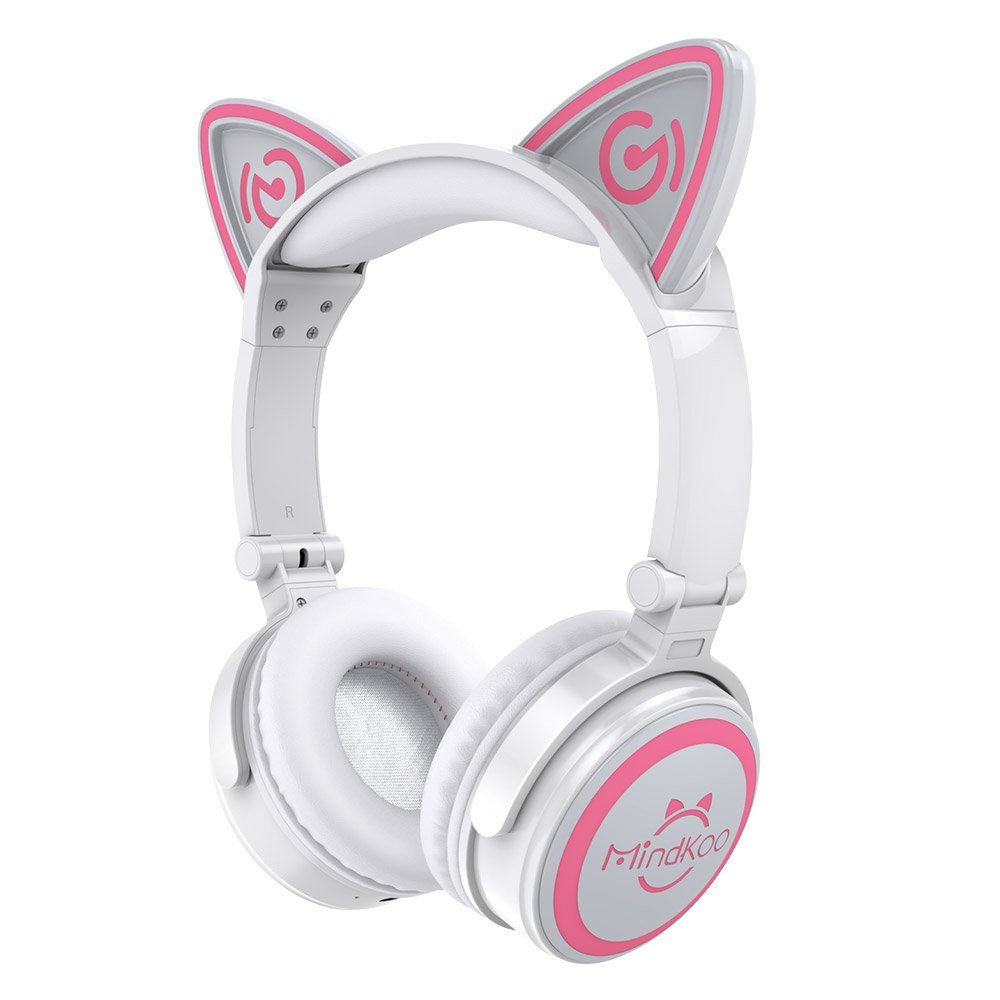
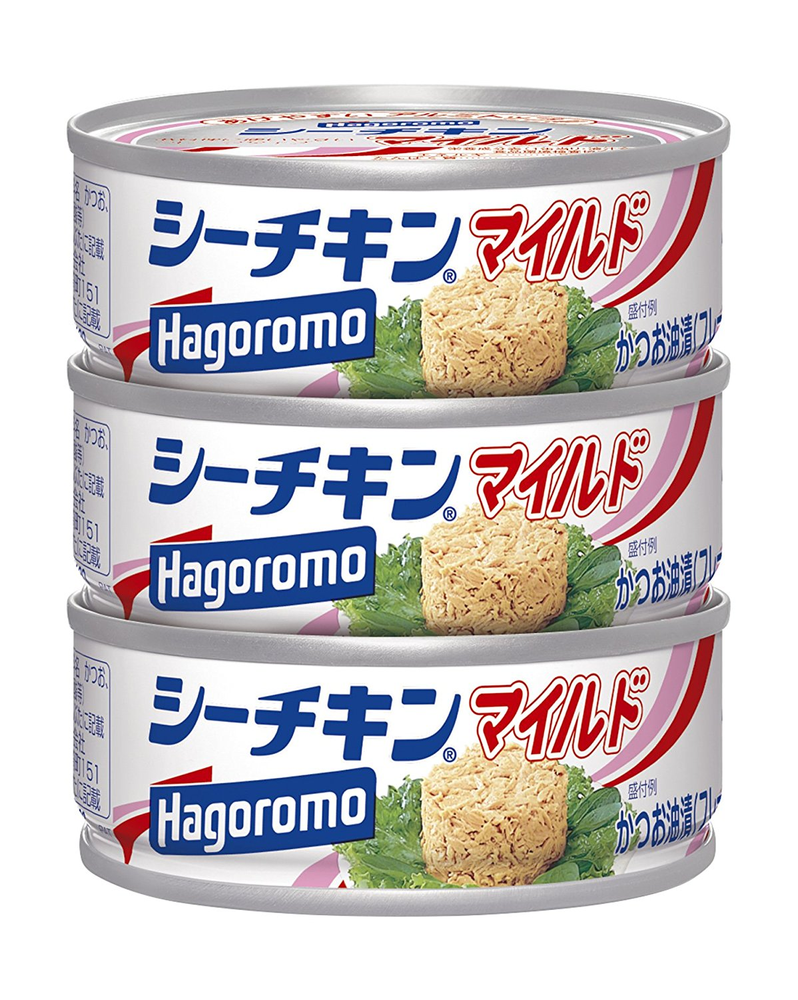
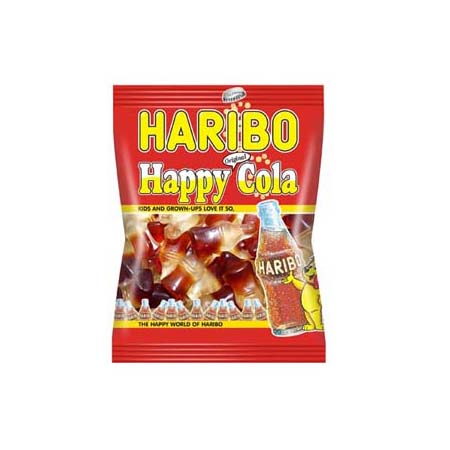

# 時間割
18:00-19:00 : TNC撤退→レク景品の運搬(タクシー)→平和楼前で誘導    
19:00       : 開始．乾杯の挨拶(  )．ちょっと遅れる可能性あり  
19:00-20:00 : お好きに飲み食い  
20:00-21:00 : ビンゴ大会  
21:00-21:30 : お好きに飲み食い？  
21:30       : 〆の挨拶(  )、終了  

# ビンゴ大会
## 必要な人員
2名

・ビンゴ回す＆数字読み上げるマシーン

・数字をどっかに書いていくマシーン  
  → ホワイトボード、模造紙、プロジェクタetc...

## 景品の渡し方
・景品に番号を付けておき、ビンゴになった人にクジを引いてもらう．  
引いた数字に対応する景品をGet

とかとか

## ハズレ景品
景品が大雑把に家電系と食品系に分かれているので、ハズレもそれに沿ったものでいいと思う

・家電系  
ネタ系ヘッドセット  

・食品系  
シーチキン  

サバ缶  
haribo  

箱買いして1年分！！的なノリでもいいかも

## その他
持ち帰り用の紙袋とかあるとよい
 

